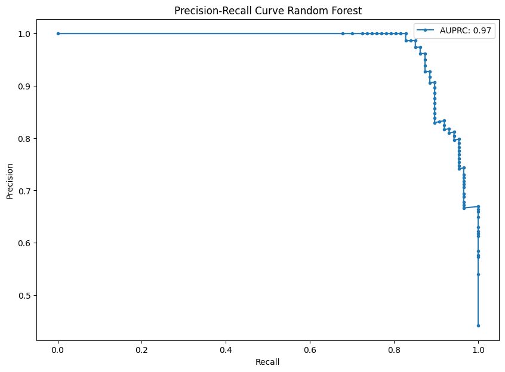

# Credit Card Fraud Detection

## Introduction
This project aims to detect fraudulent transactions in credit card data using machine learning techniques.

## Dataset
The dataset used for this project can be found on Kaggle at the following link: [Credit Card Fraud Dataset](https://www.kaggle.com/datasets/mlg-ulb/creditcardfraud).

## Technologies Used
- Python
- NumPy, Pandas, Scikit-learn
- Jupyter Notebook, Git

## Methods
- Logistic Regression
- Decision Trees
- Random Forest
- SVM
- Gradient Boosting
- KNeighbors

## Results
The models were evaluated based on the following performance metrics:
- Accuracy
- F1 Score

The performance of each model before fine-tuning is as follows:

- Logistic Regression:
  - Accuracy: 91.37%
  - F1 Score: 0.896

- Decision Trees:
  - Accuracy: 91.37%
  - F1 Score: 0.901

- Support Vector Machine (SVM):
  - Accuracy: 57.87%
  - F1 Score: 0.591

- K-Nearest Neighbors (KNN):
  - Accuracy: 64.47%
  - F1 Score: 0.624

- Random Forest:
  - Accuracy: 92.89%
  - F1 Score: 0.9125

- Gradient Boosting:
  - Accuracy: 93.40%
  - F1 Score: 0.919

The performance of each model after fine-tuning with GridSearchCV is as follows:

- Logistic Regression:
  - Accuracy (GridSearch): 93.90%

- Decision Trees:
  - Accuracy (GridSearch): 93.52%

- Support Vector Machine (SVM):
  - Accuracy (GridSearch): 90.72%

- K-Nearest Neighbors (KNN):
  - Accuracy (GridSearch): 64.43%

- Random Forest:
  - Accuracy (GridSearch): 95.55%

- Gradient Boosting:
  - Accuracy (GridSearch): 94.53%

## Conclusion
The Random Forest model achieved the highest accuracy and was chosen for further evaluation. The AUPRC achieved by the Random Forest model is 0.972.

